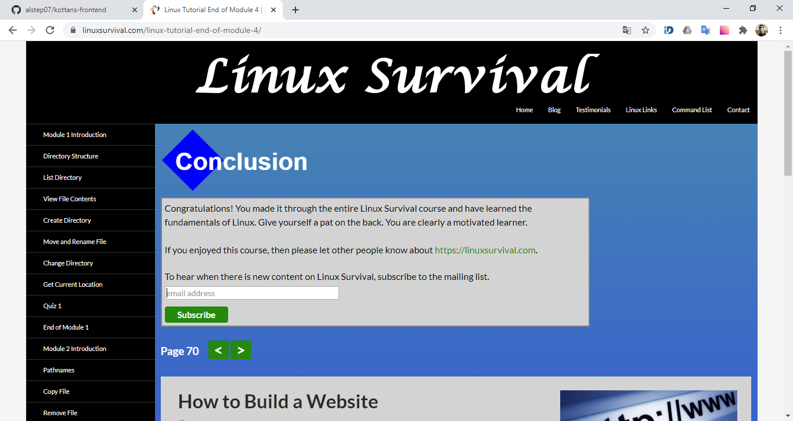

# kottans-frontend

## Progress

-   [x] Git intro
-   [x] Linux CLI, HTTP
-   [ ] Git for Team Collaboration
-   [ ] Front-End Basics
-   [ ] Responsive Layouts
-   [ ] HTML & CSS Practice
-   [ ] JavaScript Basics
-   [ ] Document Object Model
-   [ ] Building a Tiny JS World (pre-OOP)
-   [ ] Object-Oriented JavaScript
-   [ ] OOP exercise
-   [ ] Offline Web Applications
-   [ ] Memory – Pair Game
-   [ ] Website Performance Optimization
-   [ ] Friends App

## Git Intro

    
Version Control with Git

    

    
Learn Git Branching

    

-   I realized how important is to use _version control_ in software development.
-   I learned one of the most used VCS's - **Git**.
-   Now I can create _readme_ files using **Markdown**.

## Linux CLI and HTTP

    
Linux Survival

    

-   Learning Linux CLI was a useful experience for me.
-   Now I have the tools to perform some fairly sophisticated tasks in Linux
