# kottans-frontend

## Progress

-   [x] Git intro
-   [x] Linux CLI, HTTP
-   [x] Git for Team Collaboration
-   [x] Front-End Basics
-   [x] Responsive Layouts
-   [x] HTML & CSS Practice
-   [x] JavaScript Basics
-   [ ] Document Object Model
-   [ ] Building a Tiny JS World (pre-OOP)
-   [ ] Object-Oriented JavaScript
-   [ ] OOP exercise
-   [ ] Offline Web Applications
-   [ ] Memory – Pair Game
-   [ ] Website Performance Optimization
-   [ ] Friends App

## Git Intro

    
Version Control with Git

    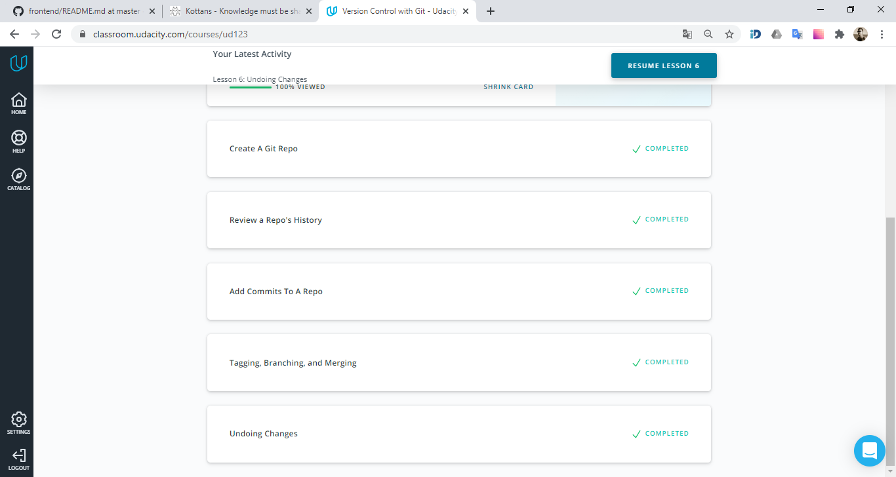

    
Learn Git Branching

    

-   I realized how important is to use _version control_ in software development.
-   I learned one of the most used VCS's - **Git**.
-   Now I can create _readme_ files using **Markdown**.

## Linux CLI and HTTP

### Linux CLI

    
Linux Survival

    

-   Learning Linux CLI was a useful experience for me.
-   The difference between using CLI and GUI surprised me.
-   Now I have the tools to perform some fairly sophisticated tasks in Linux.

### HTTP

-   A lot of things, like request and response message formats and HTTP caching, was new for me.
-   I impressed, how I can modify the request and response headers in web frameworks and libraries.
-   I intend to use my knowledge of URL structure, verbs and status codes.

## Git Collaboration

    
Udacity Course

    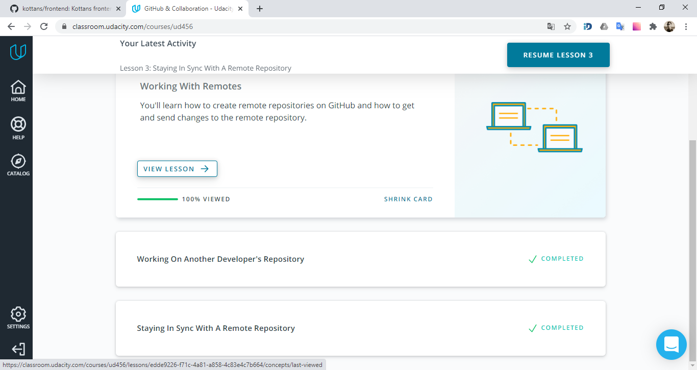

    
Learn Git Branching

    

-   Knowledge about team working with GIT was allmost new for me.
-   The power of `git rebase` surprized me.
-   I intend to read _contributing.md_ files and use pull requests in future.

## Intro to HTML and CSS

### Udacity course

    
Html & Css

    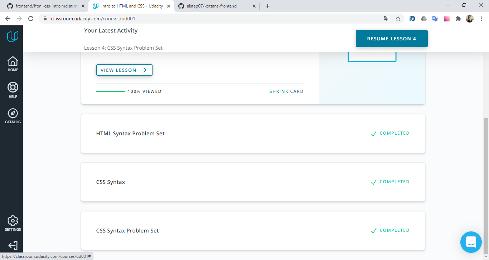

-   I already knew much information of this course, but anyway it was helpfull.

### Codecademy

    
Html

    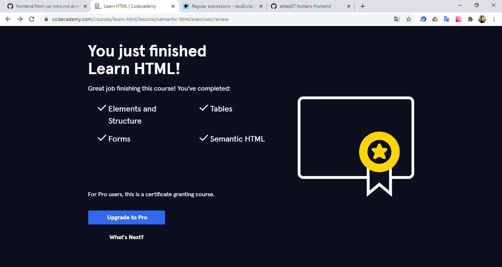

-   The most of information about html tables and forms was new for me.
-   The the benefits of Semantic HTML surprized me.
-   I intend to use semantic elements to make the code easier to read.

    
CSS

    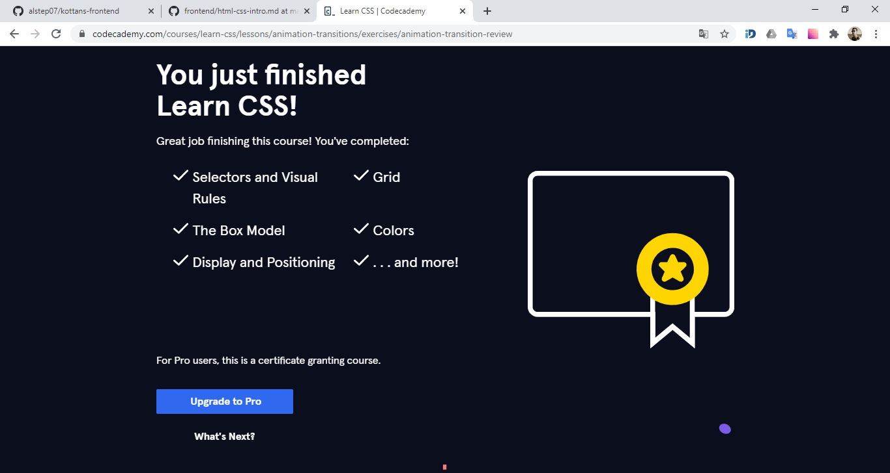

-   I solidified my knowledge about how to control the positioning of elements on a web page.
-   Css grid layouts surprized me! It's usefull.
-   I intend to use many new properties of Flex Box and Css Grid Layout.

## Responsive Web Design

    
Udacity course

    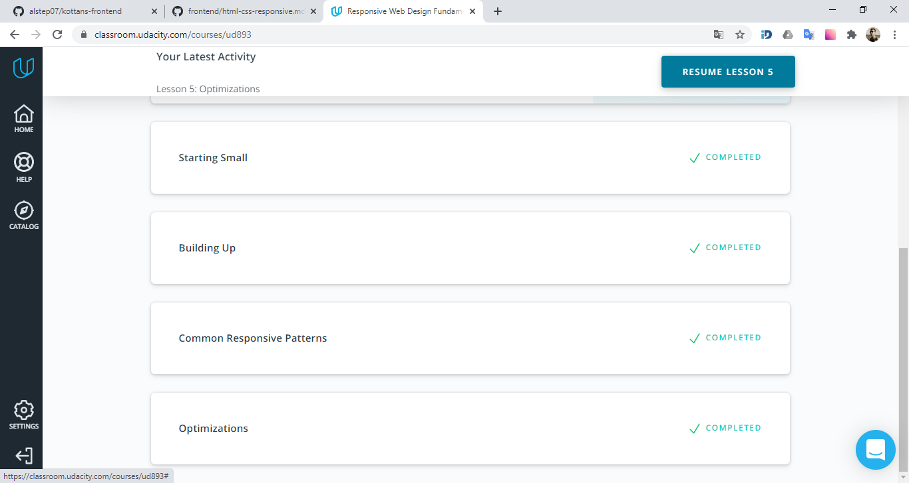

    
Flex Froggy

    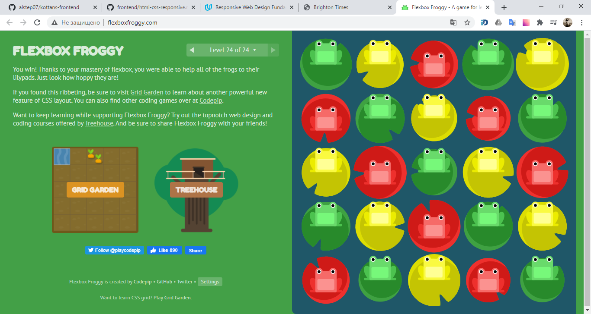

    
Grid Garden

    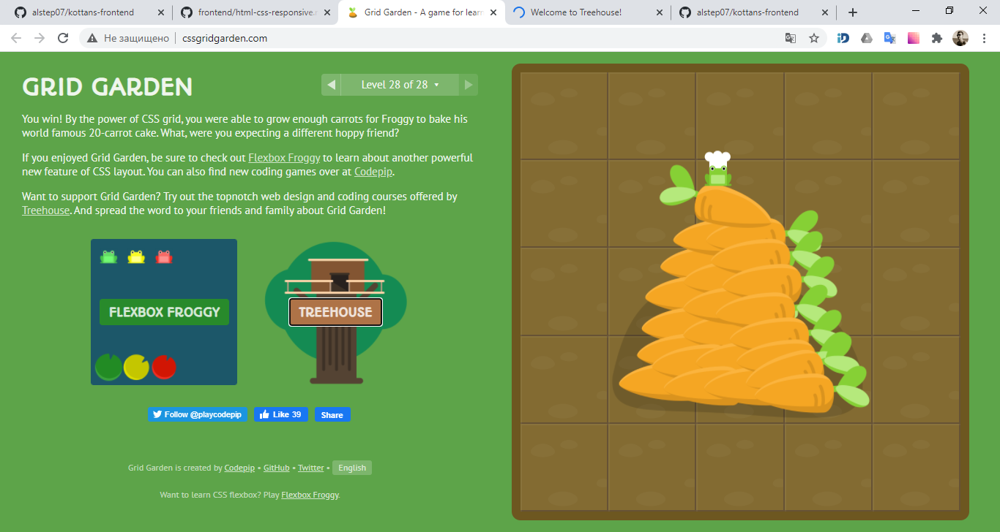

-   I found out the fundamentals of responsive web design and created my responsive web page.
-   That was very interesting to learn **Flex Box** and **CSS Grid Layout** by gaming!
-   I will use CSS media queries to make my web pages responsive for different devices.

## HTML & CSS practice

### Hooli Style Popup

[demo](https://alstep07.github.io) | [Code Base](https://github.com/alstep07/kottans-frontend/tree/master/task_hooli_style_popup)

## JS Basics

    
Udacity course

    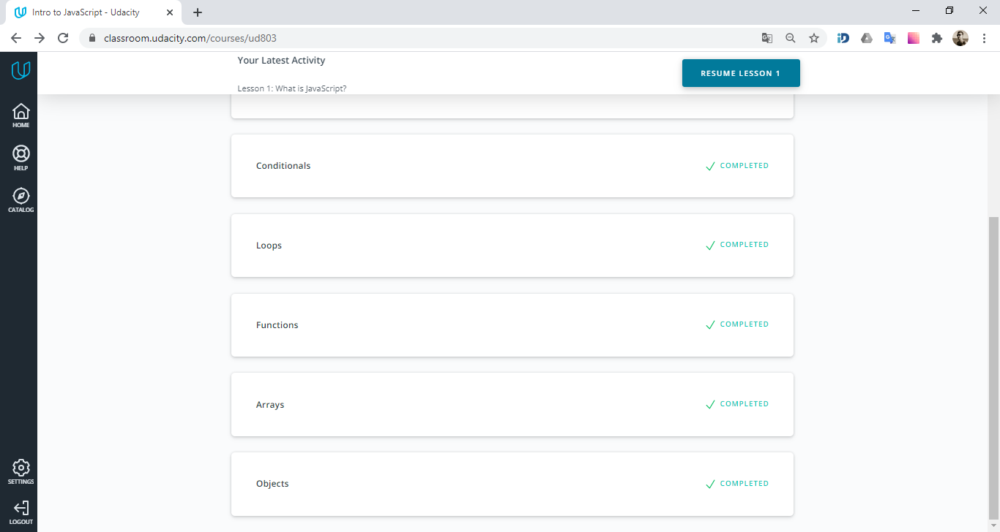

    
FreeCodeCamp Basic JavaScript

    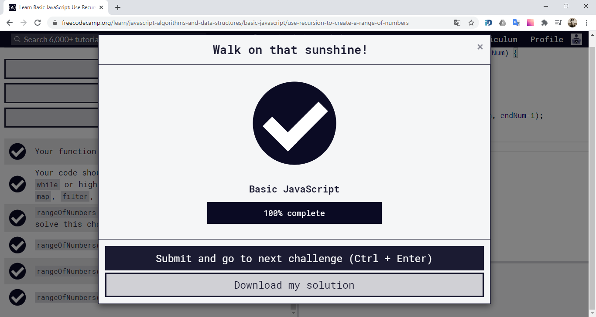

    
FreeCodeCamp ES6 Challenges

    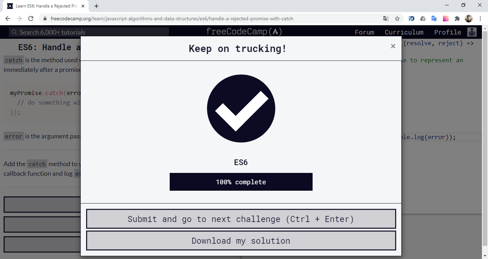

    
FreeCodeCamp Basic Data Structures

    

    
FreeCodeCamp Functional Programming

    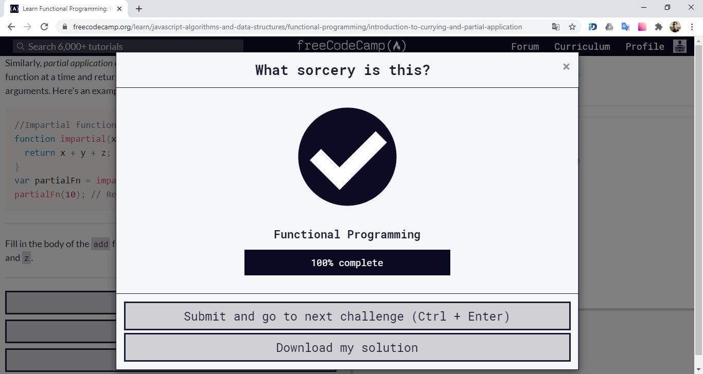

    
FreeCodeCamp Algorithm Scripting Challenges

    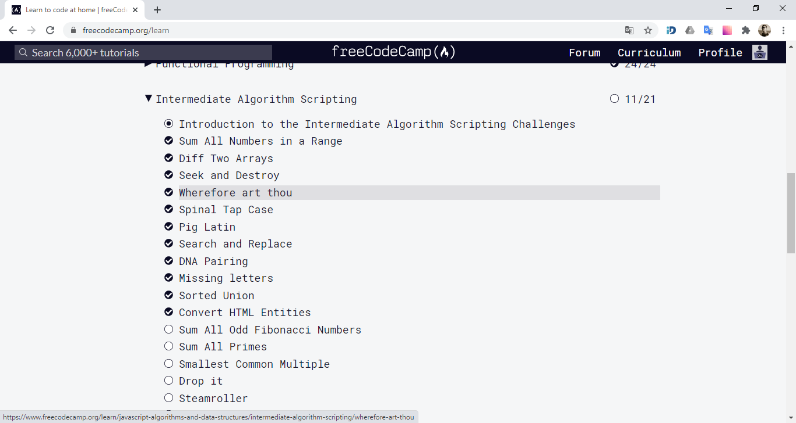

- I learned a lot of new ES6 features, like **Rest and Spread operators**, **destructuring**, etc. 
- Now I can use powerfull methods like `map(), reduce() and filter()`.
- I will try to make my code more predictable and avoid side effects, such as altering global variables.

## DOM

    
JavaScript and the DOM

    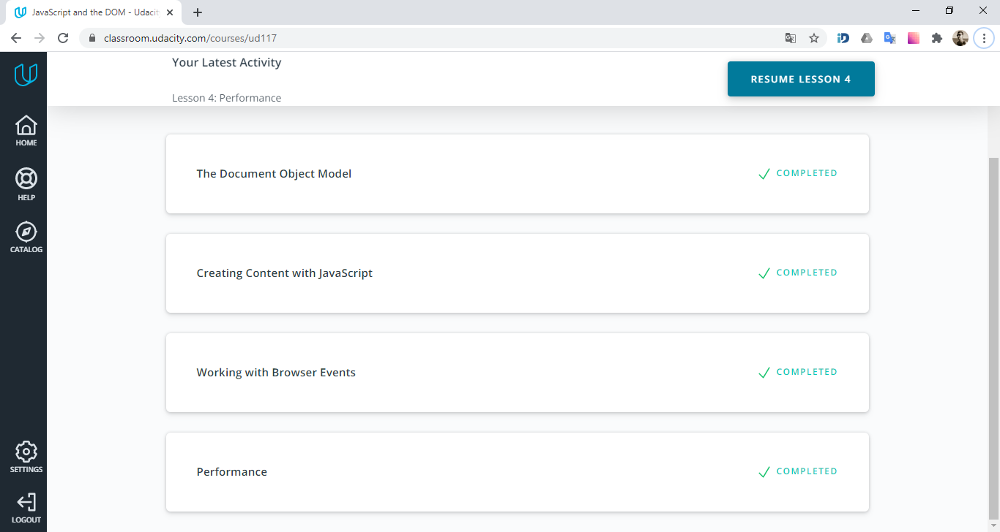

    
FreeCodeCamp Algorithm Scripting Challenges

    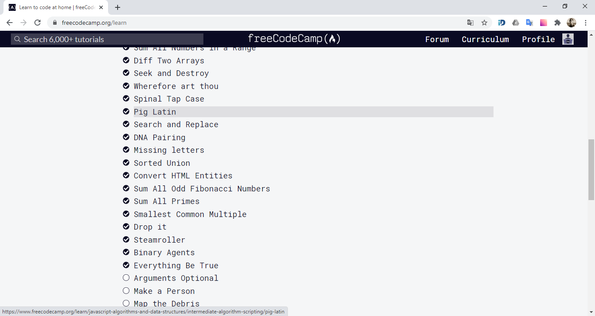

- I learned about what is the DOM and how to select items from the it.
- There are tons of methods and values in Web API.
- It was very usefull information about perfomance.

