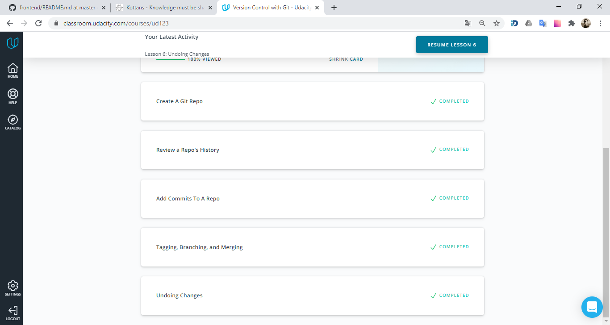
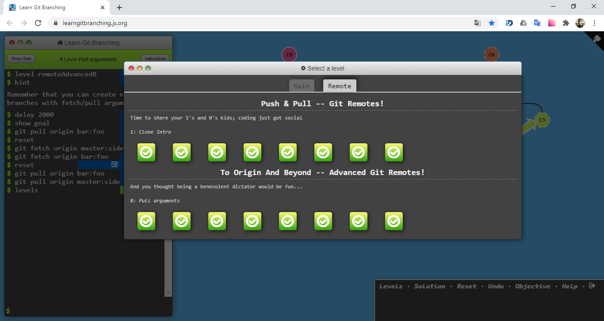

# kottans-frontend

## Progress 

- [x] Git intro
- [ ] Linux CLI, HTTP
- [ ] Git for Team Collaboration
- [ ] Front-End Basics
- [ ] Responsive Layouts
- [ ] HTML & CSS Practice
- [ ] JavaScript Basics
- [ ] Document Object Model
- [ ] Building a Tiny JS World (pre-OOP)
- [ ] Object-Oriented JavaScript
- [ ] OOP exercise
- [ ] Offline Web Applications
- [ ] Memory – Pair Game
- [ ] Website Performance Optimization
- [ ] Friends App

## Git Intro
 

    
Version Control with Git

    

    
Learn Git Branching

    

- I realized how important is to use *version control* in software development.
- I learned one of the most used VCS's - **Git**.
- Now I can create *readme* files using **Markdown**.