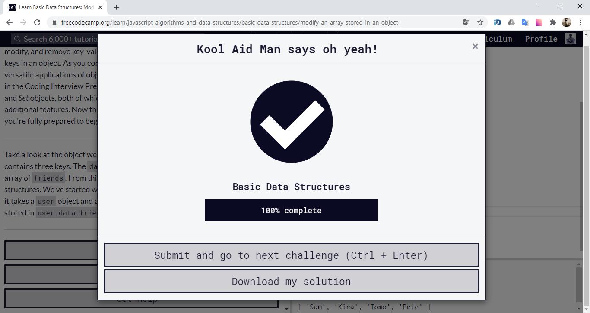

# kottans-frontend

## Progress

-   [x] Git intro
-   [x] Linux CLI, HTTP
-   [x] Git for Team Collaboration
-   [x] Front-End Basics
-   [x] Responsive Layouts
-   [x] HTML & CSS Practice
-   [x] JavaScript Basics
-   [x] Document Object Model
-   [x] Building a Tiny JS World (pre-OOP)
-   [x] Object-Oriented JavaScript
-   [x] OOP exercise
-   [x] Offline Web Applications
-   [ ] Memory – Pair Game
-   [ ] Website Performance Optimization
-   [x] Friends App

## Git Intro

    
Version Control with Git

    

    
Learn Git Branching

    

-   I realized how important it is to use _version control_ in software development.
-   I learned one of the most used VCS's - **Git**.
-   Now I can create _readme_ files using **Markdown**.

## Linux CLI and HTTP

### Linux CLI

    
Linux Survival

    

-   Learning Linux CLI was a useful experience for me.
-   The difference between using CLI and GUI surprised me.
-   Now I have the tools to perform some fairly sophisticated tasks in Linux.

### HTTP

-   A lot of information from this course, like request and response message formats and HTTP caching, was new to me.
-   I was impresse, how I can modify the request and response headers in web frameworks and libraries.
-   I intend to use my knowledge of URL structure, verbs and status codes.

## Git Collaboration

    
Udacity Course

    

    
Learn Git Branching

    

-   Knowledge about team working with GIT was allmost new for me.
-   The power of `git rebase` surprized me.
-   I intend to read _contributing.md_ files and use pull requests in future.

## Intro to HTML and CSS

### Udacity course

    
Html & Css

    

-   I already knew a lot of information from this course, but anyway it was helpfull.

### Codecademy

    
Html

    

-   Most of the information about html tables and forms was new for me.
-   The benefits of Semantic HTML surprized me.
-   I intend to use semantic elements to make the code easier to read.

    
CSS

    

-   I solidified my knowledge on how to control the positioning of elements on a web page.
-   Css grid layouts surprized me! It's usefull.
-   I intend to use many new properties of Flex Box and Css Grid Layout.

## Responsive Web Design

    
Udacity course

    

    
Flex Froggy

    

    
Grid Garden

    

-   I found out the fundamentals of responsive web design and created my responsive web page.
-   It was very interesting to learn **Flex Box** and **CSS Grid Layout** through gaming!
-   I will use CSS media queries to make my web pages responsive for different devices.

## HTML & CSS practice

### Hooli Style Popup

[demo](https://alstep07.github.io/html-css-popup/) | [Code Base](https://github.com/alstep07/kottans-frontend/tree/master/task_hooli_style_popup)

-   Making a popup-window was new for me.
-   I didn't know it could be done without JS.
-   It was usefull practice!

## JS Basics

    
Udacity course

    

    
FreeCodeCamp Basic JavaScript

    

    
FreeCodeCamp ES6 Challenges

    

    
FreeCodeCamp Basic Data Structures

    

    
FreeCodeCamp Functional Programming

    

    
FreeCodeCamp Algorithm Scripting Challenges

    

-   I learned a lot of new ES6 features, like **Rest and Spread operators**, **destructuring**, etc.
-   Now I can use powerfull methods like `map(), reduce() and filter()`.
-   I will try to make my code more predictable and avoid side effects, such as altering global variables.

## DOM

### Theory

    
JavaScript and the DOM

    

    
FreeCodeCamp Algorithm Scripting Challenges

    

-   I learned about what is the DOM and how to select items from it.
-   There are tons of methods and values in Web API.
-   It was very usefull information about perfomance.

### Practical task

[demo](https://alstep07.github.io/task-js-dom/) | [Code Base](https://github.com/alstep07/alstep07.github.io/tree/master/task-js-dom)

-   Theory is good, but practice is better!
-   It is hard when your code doesn't work, but it is the best way to learn.

## Building a Tiny JS World

[demo](https://alstep07.github.io/a-tiny-JS-world/) | [Code Base](https://github.com/alstep07/a-tiny-JS-world/blob/populate-world/index.js)

-   This tiny exercise is very usefull for a start.
-   I want to learn more about object-oriented programming in the next tasks.

## Object Oriented JS

    
Udacity course

    

-   With this course and extra materials i learned about prototypes and delegation.
-   This is a very difficult topic as for me, but it is very important to learn.
-   I intend to use OOP principles in future.

    
CodeWars

    

### Frogger Game

[demo](https://alstep07.github.io/task-js-oop/) | [Code Base](https://github.com/alstep07/frontend-nanodegree-arcade-game/tree/master)

-   This is a very good opportunity to use new knowledge.
-   I like practice tasks of this course.
-   Thanks to the mentors for the review!

## OOP exercise

[demo](https://alstep07.github.io/a-tiny-JS-world/) | [Code Base](https://github.com/alstep07/a-tiny-JS-world/blob/master/index.js)

- I saw the difference between my first method and OOP principles.
- If you have to build a big world or some other big structure you should use OOP.
- I get a lot of new knowledge through every review.

## Offline Web Applications

    
Udacity course

    

- Unfortunately I could not start the application to try new technologies myself.
- But anyway I got acquainted with Service Worker and Indexed DB.
- To use this technologies in future I should learn it more thoroughly and try in practice.

## Memory Pair Game

> waiting for review.

## Website Performance Optimization

> I will return to this task after finishing required practice.

## Friends App

[demo](https://alstep07.github.io/friends-app/) | [Code Base](https://github.com/alstep07/friends-app)

- Through this task I got acquainted with async JS (but it's still difficult topic and I need more knowledge).
- I was interesting to work with different array methods to sort and filter a data.
- It was very usefull task and I will learn more about promises and async/awaits.
